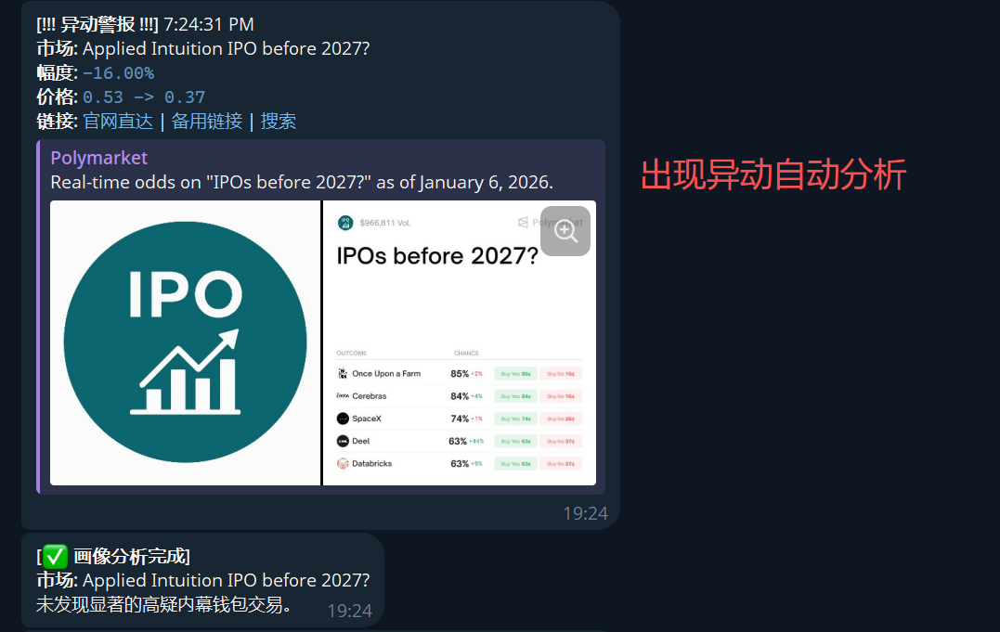
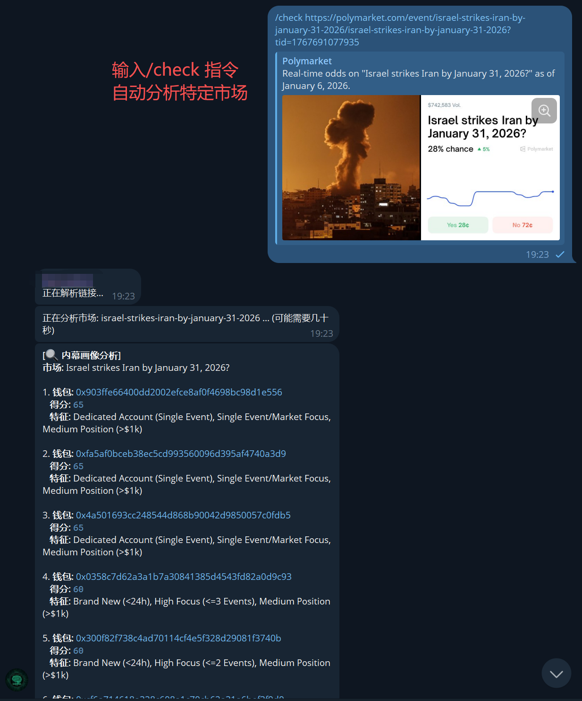

# Poly-sniper

<div align="center">
  
</div>

Poly-sniper 是一个针对 Polymarket 的全市场追踪与异动监测分析工具。它能够实时监控市场动态，发现资金异动，并提供深入的钱包分析功能，旨在帮助用户捕捉市场机会并识别潜在的内幕交易行为。

## 🚀 主要功能 (Features)

1.  **全市场追踪 (Total Market Tracking)**
    *   实时追踪和监控 Polymarket 上的所有预测市场，不错过任何重要动态。

2.  **市场异动自动报警 (Anomaly Detection & Alerts)**
    *   通过智能算法监测市场资金流向和赔率变化。
    *   当检测到异常波动或大额资金介入时，系统会自动触发报警，并立即进行初步的画像分析。

    
    *^ 系统自动捕捉异动并推送包含价格变动、市场链接及初步分析的警报。*

3.  **可疑内幕钱包分析 (Suspicious Wallet Analysis)**
    *   **自动分析**: 针对捕捉到的异动事件，自动关联并分析相关参与钱包的交易历史和行为模式。
    *   **手动分析 (`/check`)**: 支持通过指令手动查询特定钱包或市场，深度挖掘潜在的内幕交易线索。

    
    *^ 用户可随时发送 `/check` 指令对特定市场进行深度扫描，获取嫌疑钱包评分与特征。*

4.  **Telegram 自动推送 (Telegram Notification)**
    *   集成 Telegram Bot， 将市场异动警报、分析报告实时推送到你的 Telegram 频道或群组，让你随时随地掌握第一手信息。

## 🛠 环境配置 (Configuration)

### 1. 环境依赖 (Prerequisites)

*   [Node.js](https://nodejs.org/) (建议 v18 或更高版本)
*   npm (Node.js 自带)

### 2. 安装 (Installation)

```bash
git clone https://github.com/Winston-9527/poly-sniper.git
cd poly-sniper
npm install
```

### 3. 每个环境需要配置变量 (.env)

在项目根目录下创建一个 `.env` 文件，并填入以下配置信息：

```env
# Telegram Bot 配置 (用于接收报警推送)
TELEGRAM_BOT_TOKEN=your_telegram_bot_token
TELEGRAM_CHAT_ID=your_telegram_chat_id
# 是否启用 Telegram polling（用于接收 /check 指令）
TELEGRAM_POLLING_ENABLED=false
TELEGRAM_POLLING_INTERVAL_MS=2000
# 是否启用 Telegram webhook（用于接收 /check 指令）
TELEGRAM_WEBHOOK_ENABLED=false
TELEGRAM_WEBHOOK_URL=
TELEGRAM_WEBHOOK_PORT=8792
TELEGRAM_WEBHOOK_PATH=/telegram/webhook
TELEGRAM_WEBHOOK_SECRET=

# 区块链与网络配置
# Polygon RPC 节点地址 (用于链上数据分析)
POLYGON_RPC_URL=https://polygon-rpc.com
# 或者使用通用的 RPC_URL
RPC_URL=https://polygon-rpc.com
# 优先使用 Alchemy（可填 API Key 或完整 RPC URL）
ALCHEMY_API_KEY=your_alchemy_key
ALCHEMY_RPC_URL=https://polygon-mainnet.g.alchemy.com/v2/your_alchemy_key

# (可选) 代理配置 - 如果你的网络环境需要代理才能访问 Polymarket 或 Telegram API
HTTPS_PROXY=http://127.0.0.1:7890
HTTP_PROXY=http://127.0.0.1:7890
```

*   **获取 Telegram Token**: 在 Telegram 中联系 [@BotFather](https://t.me/BotFather) 创建新机器人获取 Token。
*   **获取 Chat ID**: 将你的机器人拉入群组，或直接私聊，通过相关工具或 API 获取 Chat ID。

### Telegram Webhook (Cloudflare Tunnel)

当你需要稳定接收 `/check` 指令时，推荐使用 Cloudflare Tunnel（无需公网域名）。

前置条件：本机已安装 `cloudflared`。

**快速启动（推荐）**
```bash
bash scripts/start-telegram-webhook.sh
```

脚本会自动：
1) 启动 `cloudflared` 隧道
2) 获取公网 HTTPS 地址
3) 注入环境变量并启动服务

**手动启动（可选）**
```bash
cloudflared tunnel --url http://127.0.0.1:8792
```

将输出的 `https://xxxx.trycloudflare.com` 写入 `.env`：
```env
TELEGRAM_WEBHOOK_ENABLED=true
TELEGRAM_POLLING_ENABLED=false
TELEGRAM_WEBHOOK_URL=https://xxxx.trycloudflare.com/telegram/webhook
```

## 🚀 使用指南 (Usage)

### 启动监控 (Start Monitoring)

**开发模式:**
```bash
npm run dev
```

**生产模式:**
1. 编译代码:
    ```bash
    npm run build
    ```
2. 启动:
    ```bash
    npm start
    ```

### 常用指令

在 Telegram 中与机器人交互 (需确保服务已启动):
*   `/check <参数>`: 手动触发对特定目标的分析 (具体参数格式请参考内部文档或代码)。

### MCP 工作流节点 (MCP Node)

用于在 Agent Workflow 中作为独立节点运行，提供异动事件的标准化接口。

**启动 MCP 服务**
```bash
MCP_AUTO_START=true MCP_PORT=8788 node --loader ts-node/esm src/mcp/server.ts
```

**测试 MCP 接口**
```bash
npm run test:mcp
```

**Webhook 推送地址**
- `LANGGRAPH_WEBHOOK_URL`: 当 Sentinel 检测到异动时，将异动事件推送到该地址。

### LangGraph 工作流示例

项目内提供最小 LangGraph 工作流脚本，串联 MCP 异动数据与 LLM 分析。

**运行集成测试**
```bash
npm run test:workflow
```

**解析真实市场参数**
```bash
E2E_MARKET_SLUG="<slug>" npm run test:e2e:resolve
# 或者
E2E_MARKET_ID="<tokenId>" npm run test:e2e:resolve
```

**生产端到端测试**
```bash
E2E_MARKET_ID="<tokenId>" E2E_CONDITION_ID="<conditionId>" npm run test:e2e:prod
```

**环境变量**
- `OPENAI_API_KEY`: LLM API Key（生产环境必须配置）
- `OPENAI_MODEL`: 模型名称，默认 `gpt-4o-mini`
- `OPENAI_BASE_URL`: 兼容 OpenAI 的第三方接口地址（如 OpenRouter、Gemini）
- `PROFILER_API_URL`: 钱包画像服务地址（真实画像必填）
- `PROFILER_AUTO_START`: 是否自动启动 Profiler 服务
- `PROFILER_PORT`: Profiler 服务端口
- `WORKFLOW_USE_MOCK_LLM`: 测试时可设为 `true`
- `WORKFLOW_USE_MOCK_WALLETS`: 测试时跳过真实钱包画像

## 🗺️ 发展路线图 (Roadmap)

我们致力于持续优化 Poly-sniper 的智能化程度：

- [ ] **大模型深度分析**: 接入 LLM (大语言模型) 辅助钱包行为分析，提供更自然、更深度的内幕交易嫌疑报告。
- [ ] **智能阈值优化**: 根据市场资金沉淀量 (Volume/Liquidity) 动态调整异动报警的权重和阈值，减少误报，提高信号准确度。

## 🤝 贡献 (Contributing)

欢迎提交 Issue 或 Pull Request！

## 📄 许可证 (License)

[MIT License](LICENSE)
