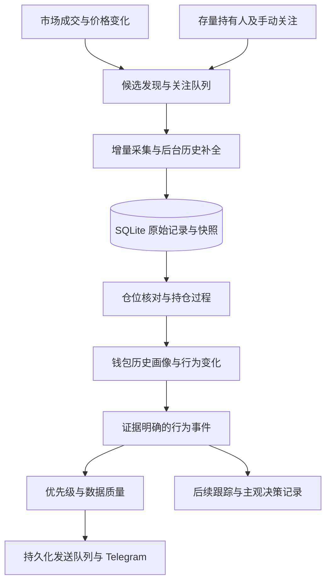

# Poly-sniper 钱包画像与资金动向改进方案

状态：待实施的设计方案；本文不代表相关能力已经上线。

日期：2026-10-09（Asia/Shanghai）。

基线：`main` 的 `905f53f`；替代 [PR #1](https://github.com/Winston-9527/poly-sniper/pull/1) 的整体实施方案，保留其中可复用的技术探索。

## 1. 目标与范围

将 Poly-sniper 从“价格异动后查询可疑钱包”，升级为“持续观察钱包画像、持仓变化和资金动向”的个人研究工具。使用者既顺势参与，也会判断异动过头后反向参与，因此报告必须同时呈现增仓、减仓、退出和反向参与的证据。

系统应回答五个问题：

1. 这个钱包长期关注什么，通常如何交易？
2. 它原来持有什么，本次具体改变了多少？
3. 本次变化相对它自己的历史、原有持仓和市场规模是否反常？
4. 可观察资金从哪里来、去了哪里，有没有跨市场配置变化？
5. 哪些事实已核对，哪些只是推断，哪些历史仍然缺失？

首版交付以 Telegram 报告、钱包查询和服务器持续采集为主。自动下单、自动跟单、内幕概率、全链完整索引、用 LLM 猜测动机不属于首版范围。不得将单周收益或少量市场样例视为策略有效性验证。

## 2. 核心设计决策

| 决策 | 原因 |
| --- | --- |
| 以钱包及其持仓过程作为持续分析对象 | 相同的卖出金额，可能是部分兑现，也可能是完全退出 |
| 市场异动和钱包行为变化均可触发分析 | 重要资金可能先行动、价格后变化 |
| 同时观察近期交易者与重要存量持有人 | 近期没有成交的长期大户也需要建立背景 |
| 72h 只作为一种查询视图 | 长尾市场的建仓、持有和退出可能跨越数月 |
| 分开呈现关注优先级、行为类型和数据可信度 | 数据缺失不等于低风险，更不能反向加分 |
| 先保存事实，再计算画像与报告 | 支持重算、回放、规则比较和错误修正 |
| 单机先用 SQLite | 适合现有 Mac 服务的部署形态；多机并发写入时再评估 PostgreSQL |

## 3. 分析口径与边界

### 3.1 钱包、控制关系与资金关系

- 钱包地址是观察单位；owner、签名者和自然人不是同一个概念。
- owner/getOwners 读取结果属于控制关系证据。多签应记录完整签名者集合和可获得的阈值，不能只取第一个地址认定同一主体。
- 控制关系需要观察时间、有效区间及复核；不能永久缓存为不变事实。
- 相同入金来源仅表示资金联系。公共交易所、桥、托管和中继服务不能直接用于合并身份。
- 链上转账的发送方应从对应资产转账事件核验；交易发起者 `tx.from` 不必然是资金提供者。
- 汇总关联钱包时，保留关联证据强度；确定属于同一观察组的内部转移单列，不重复计作该组外部流入、流出。

### 3.2 资金与仓位

- 成交额是流量，持仓份数是存量；不得用累计买入金额替代当前仓位。
- Yes、No 以及其他结果 token 分别记录份数、价格和估值时间，不混加份数后统一定价。
- 买入/卖出不自动等于建仓/清仓；需结合之前的持仓和非成交活动。
- 资金转入、卖出回款、赎回回款、奖励及其他现金变化分别记录，不能混成“新增资金”。
- 一组钱包净买入不代表整个市场有同等规模的外部资金流入。报告需说明观察集合和统计口径。
- 已观察到持仓归零可称为“本地址退出”；不能据此断言某个人全部退出或没有外部对冲。
- 跨市场总持仓价值可展示，但不同结果之间的方向风险不能直接相加成一个“净看多金额”。

### 3.3 时间与未知状态

- 区分源事件时间 `event_at`、系统获取时间 `observed_at`、画像计算时间 `computed_at` 和报价时间。
- 首次可验证活动、最早已获取活动、本机首次看到钱包分别存储。本机首次看到不能用于证明账户新。
- 区分价格变化窗口、检测时刻和消息发送时刻；报告“提前进场”必须指出相对哪个时刻。
- 缺失值使用未知状态，不用 0 代替；有效零持仓与查不到持仓必须不同。
- 所有时间内部统一 UTC，展示使用 Asia/Shanghai 并注明时区。

## 4. 总体流程

原始采集、事实归一化、派生分析、消息发送分离。采集失败不产生“未发现异常”的成功报告。历史补全不阻塞已有可信数据的展示。

## 5. 候选发现与持续关注

### 5.1 五个入口

| 入口 | 纳入对象 | 查询与保留策略 |
| --- | --- | --- |
| 近期成交 | 显著买入、卖出或方向变化的钱包 | 按金额和相对变化发现，不只选顺着价格的人 |
| 重要存量持有者 | 市场主要持有人、集中持仓者 | 建立快照，持续观察退出前后的变化 |
| 钱包行为异常 | 沉寂后恢复、规模放大、首次明显减仓等 | 相对自己的历史基线触发 |
| 手动关注 | 用户指定地址、市场和事件 | 不受自动候选排名淘汰，优先保障预算 |
| 关系扩展 | 有明确控制关系或资金往来的钱包 | 按证据强度和预算有限扩展 |

不同入口保留查询配额和最低覆盖预算；禁止全局只按“同向分前 25 名”查询。使用轮转调度和全局请求预算，避免一个热门市场耗尽所有请求。每个钱包的来源、入选原因、最后采集时间、下次采集时间都需可查。

钱包状态建议为发现、补全中、持续关注、低频观察、归档。长期不交易的存量大户进入低频观察，不因静默自动失去全部背景。用户手动关注只有用户取消或明确归档规则才退出。

### 5.2 时间与采集预算

- 行为窗口同时支持分钟/小时级与日级视图；不将单个窗口当作完整历史。
- 画像参考近期与长期基线，例如 30/90 天及全部已获取历史；样本数不足时不输出稳定性结论。
- 持仓过程从可验证建仓或初始快照持续到退出，不受 72h 截断。
- 长尾市场适当向前回溯，热门市场使用增量游标；请求页数是资源预算，不能当作覆盖承诺。
- 实际采集频率根据关注等级、接口限制和服务器实测耗时确定，配置与实际采集延迟一起展示，不先承诺“全市场实时”。

## 6. 采集、历史补全与数据核对

### 6.1 接口契约核验是实施起点

PR #1 的路径、资产地址和字段均视为待核验假设。实现前确认当前实际可用的 API/链上来源、版本、分页上限、排序、身份字段、结果 token 映射、maker/taker 覆盖、成交唯一标识、资金资产及非成交活动类型。

保存脱敏的接口响应样例用于契约测试。接口不支持完整历史时，应选择可验证的补充来源或记录缺口，不靠增加配置中的回看天数宣称已补全。

### 6.2 冷启动和增量

1. 新钱包先获取当前持仓、可用余额及近期活动，形成有时间戳的初始快照。
2. 后台分页补充更早活动；如果未到历史起点，记录“最早已取到时间”和截断原因。
3. 增量采集使用来源可用游标或水位，并重叠读取近期区间处理延迟数据；经去重后幂等入库。
4. 原始记录入库与采集水位推进置于一致的提交边界，防止崩溃后跳过数据。
5. 定期获取新快照，对比账本推导与来源持仓。延迟、不一致和暂时缺失先重试、标注，不能直接解释为交易。

一个交易哈希可含多笔成交或转账，不能作为唯一去重键。优先使用来源事件 ID、成交 ID，或链/交易/日志索引加事件角色；没有稳定 ID 的来源需记录合成键局限并核对，避免把真实同额成交去重掉。跨 API 与链上来源应保留映射，不重复入账。

### 6.3 仓位和资金账本

按钱包 × 市场 × token 保存份数变化，并分别处理可核验的成交、转账、拆分、合并、赎回等来源。具体支持类型以契约核验为准。未支持的操作进入未解释变化，不被伪造成买卖。

现金账本区分外部转入/转出、交易支付/回款、赎回及其他来源。资产单位、精度、估值价格分别存储；金额和份数使用精确十进制或适当缩放整数，避免二进制浮点累计误差和整数溢出。

初始快照可以开启“观察中的持仓过程”，但不能据此补造历史买入成本。历史成本不完整时，禁用依赖完整成本的 PnL 结论；仍可展示此后可核验的份数和现金变化。链上来源若遇重组或更正，应按来源标识修订并重算受影响派生结果，保留修订记录。

## 7. 钱包画像和行为解释

### 7.1 画像字段

| 部分 | 输出 | 数据不足时 |
| --- | --- | --- |
| 活跃历史 | 可验证首笔活动、已观察时长、覆盖区间 | 只报告已知下界，不判新号 |
| 事件偏好 | 近期/长期事件分布、资金集中度 | 显示样本覆盖，不把局部当终身 |
| 交易规模 | 单次及一段行为的金额分位数、典型规模 | 不输出夸张的倍数 |
| 持仓习惯 | 持有时长、加减仓频率、退出方式 | 区分已结束与仍在持有的过程 |
| 当前组合 | 各 token 仓位、现金、组合集中度 | 只基于已覆盖的组合，不称全部财富 |
| 关系背景 | 控制关系、资金往来、有效时间与证据 | 不强行合并身份 |
| 历史表现 | 可核验已实现/未实现收益及样本量 | 成本不完整时不算精确胜率或收益率 |

“典型交易规模”必须定义聚合口径：能关联订单时优先按订单归并；否则明确使用配置的行为窗口，并标记可能拆单。一次订单的三次成交不能直接解释成三次独立加仓决策。基线计算排除当前待评估行为，记录时间范围、样本数和算法版本。

### 7.2 行为事件

首版识别：新出现的仓位、显著加仓、部分减仓、退出、沉寂后恢复，以及可解释的资金转入/转出。数据不完整时使用“新观察到持仓”“疑似退出，待核对”等表述。

后续识别：持续增仓/退出、跨方向配置变化、跨市场同期调仓、关联钱包的同步变化。买卖双边只是输入事实，不能直接推断做市或对冲；减仓亦不自动解释为止盈止损。

“同一批资金转移”需要资金路径证据。卖出 A 后买入 B 而只有时间接近时，只展示“同期卖出 A、买入 B”。如果增加公开消息时间线，应保留消息链接和发布时间，资金行为与新闻先后关系仍不等于因果或内幕证据。

### 7.3 优先级与通知

首版使用可解释规则，输出高/中/低关注优先级及触发原因，不给“内幕概率”。行为类型、数据质量单独展示。

优先级考虑绝对规模下限、相对钱包历史规模、原仓位变化比例、相对市场活跃度、是否持续以及是否首次改变长期行为。避免微小基数导致倍数虚高。资金很多、新号、同源关系只作背景或辅助证据，不作为所有报告的必要条件。

阈值先作为可配置假设，保存版本，经过影子运行后调整。对于尚无历史的新钱包，可按绝对规模和市场背景发现，但不伪造历史异常倍数。没有达到优先级的原始事件仍存储，供后续评价筛选是否漏报。

每个钱包/市场/行为过程采用冷却、升级和恢复机制；显著新增证据、继续减仓或方向变化可更新同一报告。超限消息进入持久化队列或合并摘要，不能消耗唯一报警机会后永久丢弃。发送任务记录 pending/sent/retry/dead 等状态与消息 ID；发送成功但确认回写前崩溃的重复风险需明确处理，不承诺跨网络绝对恰好一次。

## 8. 持久化设计

采用本地持久磁盘上的 SQLite，开启外键和 WAL，写操作由受控队列批量提交；API 请求期间不持有写事务。后台回填和在线采集共享请求预算，并通过短事务和忙等待/退避减少写入争用。数据库、备份、生产日志和密钥不进入 Git。

| 数据组 / 建议表 | 关键内容 | 用途 |
| --- | --- | --- |
| `markets`, `outcome_tokens` | event/condition/token 标识、结果、状态、规则和观察时间 | 正确关联市场与方向 |
| `wallets`, `watchlist` | 标准地址、关注来源/等级/状态、本机首次看到时间 | 管理长期观察名单 |
| `source_records`, `wallet_activities` | 原始载荷、来源键、规范化类型、份数/金额、双时间戳、修订 | 去重、核对、重新计算 |
| `position_snapshots`, `balance_snapshots` | 钱包/token/资产、数量、快照时间、完整度、报价引用 | 对比变化，建立历史起点 |
| `position_episodes`, `ledger_entries` | 初始状态、变化、退出、来源记录关联、成本覆盖 | 重建持仓过程及现金变动 |
| `wallet_relations` | 两端地址、关系类型、证据、有效时间、可信程度 | 控制关系与资金联系 |
| `profile_versions` | 截止时间、覆盖范围、指标、基线口径、算法版本 | 还原当时已知的钱包背景 |
| `behavior_events`, `alert_outbox` | 事件类型、证据引用、阈值版本、发送及重试状态 | 解释报警，避免静默丢消息 |
| `collection_state`, `data_gaps` | 游标、水位、最早/最新记录、截断、失败和重试 | 重启续采与历史补全 |
| `market_observations` | 价格、价差、按预算保存的成交/盘口摘要与时间 | 还原市场背景与观察后表现 |
| `decisions`, `followups` | 顺势/反向/放弃、理由、实际交易及固定窗口结果 | 评估哪些报告有用 |

表名是实施建议，具体迁移按阶段拆分。对来源键设唯一约束；对钱包+时间、市场/token+时间、待发送状态和待采集时间建立相应索引。派生表保留来源证据和算法版本；重算不覆盖原始事实和当时已发送的报告版本。

核心钱包活动、快照、报告和决策长期保留，按实际增长评估归档。高频盘口只针对重点市场有限保留，过期后保留摘要。备份使用 SQLite 一致性备份方式，不能在运行中只复制主文件而忽略 WAL；按配置自动备份并执行恢复演练。先单机运行，确有多机写入需求时再迁移数据库。

## 9. 用户报告与查询

### 9.1 报告示例（以下全部为示意数字）

> **长期持有人显著减仓**
>
> 钱包 A：已观察活跃 14 个月，主要参与政治事件。
>
> 本市场：持仓已观察 47 天。
>
> 最近 30 分钟：Yes 从 100,000 份降至 30,000 份，减仓 70%。
>
> 成交规模：约为过去 90 天同口径行为窗口典型规模的 6 倍；附样本数和口径。
>
> 当前状态：仍持有 Yes；截至本次观察，未发现买入 No。
>
> 资金变化：有卖出回款；已覆盖地址及区间内未观察到外部转出。
>
> 市场背景：同期 Yes 上涨；其他重点持有人中，两人加仓、一人减仓（展示观察对象总数）。
>
> 数据完整度：本次前后持仓已核对；早期建仓成本不完整。
>
> 证据：钱包/市场/交易链接，观察区间，数据更新时间，规则版本。

默认报告先给行为与背景，再给证据和限制。不得把“没有观察到”改写成“没有发生”。可通过同一事件后续更新展示持续减仓、回补或退出。

### 9.2 交互规划

- `/check <市场链接>`：市场背景、重点增仓/减仓/退出钱包、覆盖说明。
- `/wallet <地址>`：长期画像、当前组合、最近行为和数据缺口。
- `/watch <地址或市场链接>`：加入持续关注；配套取消关注及列表查询。
- `/status`：采集延迟、关注对象覆盖、补全进度、失败和消息积压。
- 后续提供对报告记录顺势/反向/放弃及理由的简易操作。

命令为计划中的接口，不在方案 PR 中宣称已可用。实现沿用并验证 Telegram 访问控制。

## 10. 对 PR #1 的取舍

| 处理 | 内容 |
| --- | --- |
| 复用思路并重新验证 | 成交候选来源、双边方向映射、并发控制、HTML 报告、owner 读取探索 |
| 修复后再使用 | 未知年龄仍加分、双边份额混算、截断历史专注度、失败缓存、限速丢报警 |
| 替换 | 同向 top-K 单一路径、成交额兜底仓位、双边金额直接判对冲、统一 60 分门槛 |
| 扩展 | 存量持有人、持仓过程、资金账本、历史存储、数据质量、复盘 |

PR #1 的粗筛实际最高 75，乘 0.3 后行为分最高 23；成熟且无关联钱包即使其余维度满分也只有 58，无法通过默认 60 分。新方案不继承这套门槛。关闭旧 PR 只替代提案，不删除旧分支或丢弃其研究记录，也不自动变更服务器当前运行代码。

## 11. 分阶段实施与验收

### P0：核实数据与修正误导性行为

- 核验接口契约、运行环境和资产口径，形成可重复的响应样例及缺口清单。
- 修正未知年龄、双边估值、成交额替代持仓、失败冒充正常结果和报警永久丢失。
- 隔离已提交编译产物，确保构建产物与源码对应；测试入口在服务器实际 Node 版本上验证。
- 不引入新的盈利或内幕评分承诺。

验收：真实来源的小规模只读样本可正确解析；失败/空/零值分离；已知错误场景有回归覆盖。样本不证明全市场覆盖或收益。

### P1：可靠记录和可观察的仓位变化（首个可用版本）

- SQLite 迁移、原始活动、持仓/余额快照、采集进度、缺口和报警队列。
- 手动关注＋显著成交＋存量持有人入口，受控增量采集。
- 初始快照开始的加仓、减仓、退出报告及钱包查询。
- 服务重启恢复、定期备份、状态查询；旧 JSON/CSV 仅作为带来源标记的导入参考。

验收：不依赖完整历史成本也能准确说明上线后的份数变化；老钱包不被年龄门槛排除；重复采集不重复入账；限速后仍可投递或有明确合并记录；原生产服务切换前影子运行核对。

### P2：长期画像与多时间尺度

- 后台历史补全、持仓过程、近期/长期行为基线和画像版本。
- 长期持有人首次减仓、沉寂后恢复、相对历史规模异常。
- 更完整的非成交活动核对；将不能解释的变化保留为缺口。
- 低频长尾与高频热门市场使用不同采集预算，但统一展示实际覆盖。

验收：跨月持仓能连接；截断样本不被宣传成完整历史；基线排除当前待评估行为；能回放当时已经获取的信息。

### P3：资金动向、关联背景与价值验证

- 区分现金转入转出与交易回款；跨市场同期配置变化；可核验资金路径。
- 控制关系、公共来源排除、关联钱包去重聚合与证据时间线。
- 记录用户决策，跟踪不同类型报告的后续表现与实用性。
- 仅在成本覆盖满足要求时增加历史 PnL 分析。

验收：内部转账不重复计作外部资金；未知关系不强行合并；因果推断和观察事实分离；可分别评估顺势、反向和放弃的选择。

## 12. 必须覆盖的验收场景

| 场景 | 期望结果 |
| --- | --- |
| 老钱包突然大额买入 | 可以发现并报告，不要求新号或同源关联 |
| 长期 100,000 份卖出 10,000 份 | 报告减仓 10%，不能称清仓 |
| 10,000 份全部卖出且快照确认归零 | 报告本地址退出，成交额不再作为当前仓位 |
| 0.2 买入后 0.4 卖出同样份数 | 识别买入后退出，不因卖出金额更大自动判对冲 |
| Yes=0.9，仅持有 20,000 份 No | 按 No 对应价格估值，不能得到 $18,000 |
| 买卖同时出现或订单拆成多笔成交 | 保留顺序及聚合口径，不自动解释反手/多次决策 |
| 历史缺失、查询失败、首次在本机出现 | 不获得新钱包加分，不显示“分析正常” |
| 最早 200 条只涉及一个事件，历史已截断 | 不判定其终身只关注一个事件 |
| 最近两天无交易，数月前已有大仓位 | 保留存量观察，下次变化可以关联历史 |
| API 页数用尽、请求中断或记录延迟 | 展示实际覆盖及缺口，不宣称完整 72h |
| 同一交易多条日志、跨来源重复记录 | 既不漏记真实事件，也不重复入账 |
| 转账/拆分/合并/赎回造成份数变化 | 按来源类型核对；不支持时报告待解释差异 |
| 同一观察组内部转账、多签共享一个签名者 | 前者单列内部转移；后者不据此认定同一人 |
| 达到报警限速后服务重启 | 队列和采集进度恢复，无永久吞报警 |
| 数据库备份后恢复 | 能恢复快照、来源进度、事件证据与待发送状态 |

使用确定性数据测试计算及状态机，用脱敏来源样例测试接口契约，少量只读在线请求做集成核验。不通过测试向真实群组发送消息；实际推送测试需使用明确授权的测试目标。

## 13. 上线、观察与评估

每个实现阶段单独提交 PR，避免把全部模型重做一次部署。新采集器先影子运行并核对样本，再启用推送；旧缓存和新库导入需幂等，不更改首次可验证活动的含义。迁移前备份；部署回退必须明确代码与数据库版本兼容范围，不能用旧代码直接写入不兼容的新结构。

观察指标：关注钱包的有效覆盖、最新数据延迟、持仓核对一致率、未解释变化、历史补全范围、API 失败、数据库增长、消息积压与重复。没有历史真值时，不能仅以“扫描到的都处理了”宣称接近 100% 覆盖或召回率。

所有符合记录条件的行为事件都保留，包括未推送和用户放弃的。固定窗口跟踪后续价格、可用时的可成交报价及持续加减仓；模拟表现注明价差、费用、滑点和数据限制，与真实成交收益分开。不同市场/事件的相关性和仍未结束的持仓需单独考虑。

最终评价重点是：报告是否减少查证时间，是否准确解释持仓变化，是否同时支持顺势与反向判断，以及哪些行为类型在连续记录中更有用。先让事实可信、变化可追溯，再调整筛选规则。
